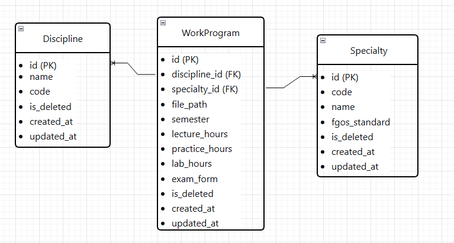

# Вариант 13: Work Program Service (Сервис рабочих программ)

## Номер варианта: 13
## Название сервиса: Work Program Service

---

## Добавить рабочую программу (Create Work Program)

### Информация требуемая для создания рабочей программы

| Параметр | Пояснение | Обязательность | Тип | Ограничение | Значение по умолчанию |
|----------|-----------|----------------|-----|-------------|----------------------|
| discipline_id | ID дисциплины | Да | integer | >0, внешний ключ | - |
| specialty_id | ID специальности | Да | integer | >0, внешний ключ | - |
| file_path | Путь к файлу рабочей программы | Да | string | max 500 символов | - |
| semester | Номер семестра | Да | integer | 1-8 | - |
| lecture_hours | Часы лекций | Да | integer | >=0 | 0 |
| practice_hours | Часы практики | Да | integer | >=0 | 0 |
| lab_hours | Лабораторные часы | Да | integer | >=0 | 0 |
| exam_form | Форма отчетности | Да | string | exam/credit/coursework | credit |

**Уникальные комбинации параметров:** (discipline_id, specialty_id, semester) - для одной специальности по одной дисциплине в семестре только одна программа

### Информация возвращаемая в случае удачного создания

| Параметр | Тип |
|----------|-----|
| id | integer |
| discipline_id | integer |
| specialty_id | integer |
| file_path | string |
| semester | integer |
| lecture_hours | integer |
| practice_hours | integer |
| lab_hours | integer |
| exam_form | string |
| is_deleted | boolean |
| created_at | datetime |
| updated_at | datetime |

---

## Изменить рабочую программу по ID

### Информация требуемая для изменения

| Параметр | Пояснение | Обязательность | Тип | Ограничение |
|----------|-----------|----------------|-----|-------------|
| file_path | Путь к файлу | Нет | string | max 500 |
| lecture_hours | Часы лекций | Нет | integer | >=0 |
| practice_hours | Часы практики | Нет | integer | >=0 |
| lab_hours | Лабораторные часы | Нет | integer | >=0 |
| exam_form | Форма отчетности | Нет | string | exam/credit/coursework |

### Информация возвращаемая в случае удачного изменения

| Параметр | Тип |
|----------|-----|
| id | integer |
| discipline_id | integer |
| specialty_id | integer |
| file_path | string |
| semester | integer |
| lecture_hours | integer |
| practice_hours | integer |
| lab_hours | integer |
| exam_form | string |
| updated_at | datetime |

---

## Удалить рабочую программу по ID

Вернет `true`, если запись была помечена как удаленная, иначе `false`.

Фактически запись из БД не удаляется, а реализуется через булевое поле `is_deleted`.

---

## Получить рабочую программу по ID

### Информация возвращаемая в случае удачного поиска

| Параметр | Пояснение | Тип |
|----------|-----------|-----|
| id | ID программы | integer |
| discipline_id | ID дисциплины | integer |
| discipline_name | Название дисциплины | string |
| specialty_id | ID специальности | integer |
| specialty_code | Код специальности | string |
| file_path | Путь к файлу | string |
| semester | Семестр | integer |
| lecture_hours | Часы лекций | integer |
| practice_hours | Часы практики | integer |
| lab_hours | Лабораторные часы | integer |
| exam_form | Форма отчетности | string |
| total_hours | Всего часов (вычисляемое) | integer |

---

## Получить список рабочих программ по заданным параметрам

### Информация требуемая для получения списка

| Параметр | Пояснение | Тип |
|----------|-----------|-----|
| discipline_id | Фильтр по дисциплине | integer |
| specialty_id | Фильтр по специальности | integer |
| semester | Фильтр по семестру | integer |
| exam_form | Фильтр по форме отчетности | string |
| limit | Количество записей | integer |
| offset | Смещение | integer |

### Информация возвращаемая в виде списка

| Параметр | Тип |
|----------|-----|
| id | integer |
| discipline_name | string |
| specialty_code | string |
| semester | integer |
| exam_form | string |
| total_hours | integer |

---

## ER-диаграмма

